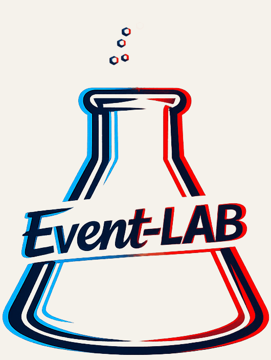

# Event-LAB: Towards Standardized Evaluation of Neuromorphic Localization Methods

<p align="center">
  
</p>


[](https://event-lab.readthedocs.io/en/latest/)
[](https://creativecommons.org/licenses/by-nc-sa/4.0/)
[](https://pixi.sh)
[](https://qcr.ai)
[](https://github.com/EventLAB-Team/Event-LAB/stargazers)
[](./README.md)


**Event-LAB** is a framework for easy, reliable evaluation of event-based localization methods across standardized datasets and pipelines.
Using **single command-line invocation**, multiple different event-based methods can be implemented. See the [Event-LAB documentation](https://event-lab.readthedocs.io/en/latest/) for further details.

If you use this code in your work, please **cite our paper** (see [License and Citation](#license-and-citation)) and consider giving the repo a star! ⭐

## Quick start :dizzy:
Event-LAB uses [Pixi](https://prefix.dev/docs/pixi/overview) by prefix.dev to manage packages and dependencies to achieve bit-for-bit reproducibility. Follow the instructions below to get started with Event-LAB.

### Installation :package:
If not already installed, [install Pixi](https://prefix.dev/docs/pixi/overview#installation) for your operating system by running the following command in your terminal:

#### Linux/MacOS
```console
curl -fsSL https://pixi.sh/install.sh | bash
```
#### Windows (Powershell)
```console
iwr -useb https://pixi.sh/install.ps1 | iex
```

### Get the repository :inbox_tray:
Download this reposistory and navigate to the project directory by running the following command in your terminal:
```console
git clone git@github.com:EventLAB-Team/Event-LAB.git && cd Event-LAB
```

### Run the demonstration :rocket:
That's it! You're ready to run Event-LAB, try it now with the demonstration by running the following command in your terminal:
```console
pixi run demo
```

## Using Event-LAB
Using simple command-line invocation, Event-LAB is designed to easily mix and match localization methods and datasets. To use Event-LAB, we simply run `pixi run eventlab <baseline_method> <dataset> <reference> <query>` in the command terminal. This triggers a series of processes starting from downloading the dataset and baseline, generating event frames, and then running the method to return Recall@1 and Precision-Recall metrics.

### Command-line invocation
Below are some examples of experiments that we can run:
```console
# Run Ensemble-Event-VPR on the Brisbane-Event-VPR with Sunset2 as the reference and Sunrise as the query
pixi run eventlab sparse_event brisbane_event sunset2 sunrise

# Run EventVLAD on the NSAVP with R0_FS0 as the reference and F0_FA0 as the query
pixi run eventlab ensemble nsavp R0_FS0 F0_FA0 
```

Event-LAB will handle the pre-processing of all individual datasets, format as required for the baseline, and then return results into an `.xslx` spreadsheet for further analysis.

### Modify the configuration
Parameters for generating event frames in Event-LAB are controlled using the `config.yaml` file in the main project directory:
```yaml
# Frame reconstruction parameters
timewindows: [33, 66, 99, 120] # The time window to collect events over
num_events: [25000, 50000, 75000, 100000] # The maximum number of events per frame, only used if frame_generator is "eventcount"
frame_generator: "reconstruction" # Options: "frames", "eventcount", "reconstruction"
frame_accumulator: "eventcount"    # Options: "count", "polarity" (default), "timestamp"
reconstruction_model: "e2vid"  # Options: "firenet", "e2vid (default)"
```
Modify the parameters to suit your experimental needs. Time windows and maximum number of events can be parsed as a list to process and analyze several conditions in a single experiment.

### Batch run experiments
It is often required and useful to run a variety of baseline methods and datasets across a standardized set of parameters. Event-LAB allows users to easily set-up and batch numerous experiments to run in series. The `batch_config.yaml` file in the main project directory can be set up to customize implementations:
```yaml
# Batch experiment parameters
batch_experiments:
  - dataset: brisbane_event
    reference: sunset2
    queries: [sunrise]
    baselines: [eventvlad, ensemble]
    config:
      frame_generator: frames
      frame_accumulator: polarity
      timewindows: [33, 66, 120, 250]
```
The above will run 3 baseline methods across 4 different time windows. Then to run the evaluation we simply run the following in the command terminal:
```console
pixi run bash
```
This will generate a `run_batch.sh` file and execute it.

### Implemented baseline methods and datasets
For the demonstration version of the repository, we have implemented two baseline methods and datasets. The full and final version of the code will be released upon acceptance which includes the other methods. Below is the list of implemented methods and their invocation name:

| Baseline | Source | Invocation |
| --- | --- | --- |
| EventVLAD | [alexjunholee/EventVLAD](https://github.com/alexjunholee/EventVLAD) | `eventvlad` |
| Ensemble-Event-VPR | [Tobias-Fischer/ensemble-event-vpr](https://github.com/Tobias-Fischer/ensemble-event-vpr) | `ensemble` |
| LENS | [AdamDHines/LENS](https://github.com/AdamDHines/LENS) | `lens` |
| Sparse-Event-VPR | [Tobias-Fischer/sparse-event-vpr](https://github.com/Tobias-Fischer/sparse-event-vpr) | `sparse_event` |
| VPR-Methods | [gmberton/VPR-methods-evaluation](https://github.com/gmberton/VPR-methods-evaluation) | `vprmethods` |

| Dataset | Source | Invocation |
| --- | --- | --- |
| Brisbane-Event-VPR | [TobiasRobotics/brisbane-event-vpr](https://huggingface.co/datasets/TobiasRobotics/brisbane-event-vpr) | `brisbane_event` |
| NSAVP | [umautobots.github.io/nsavp](https://umautobots.github.io/nsavp) | `nsavp` |
| Fast-and-Slow | [QVPR/QCR-Fast-Slow-Event-Dataset-Raw-Parquets](https://huggingface.co/datasets/QVPR/QCR-Fast-Slow-Event-Dataset-Raw-Parquets) | `fast_slow` |
| QCR-Event-VPR | [Zenodo record 10494919](https://zenodo.org/records/10494919) | `qcr_event` |

Any combination of implemented baseline methods, datasets and their traverses can be set-up for a reference/query pair to evaluate performance.

## License and Citation
This repository is licensed under the permissive [MIT License](./LICENSE). If you use our code, please cite our [paper](https://arxiv.org/abs/2509.14516):

```
@inproceedings{HinesEventLAB2026,
      title={Event-LAB: Towards Standardized Evaluation of Neuromorphic Localization Methods}, 
      author={Adam D. Hines and Alejandro Fontan and Michael Milford and Tobias Fischer},
      year={2026},
      booktitle={IEEE International Conference on Robotics and Automation}     
}
```

Where using baselines or datasets from other authors in your evaluation as implemented in our code, please ensure you additionally cite the correct source material. 

## Issues, bugs, and feature requests
If you encounter problems whilst running the code or if you have a suggestion for a feature or improvement, please report it as an [issue](https://github.com/EventLAB-Team/Event-LAB/issues).
